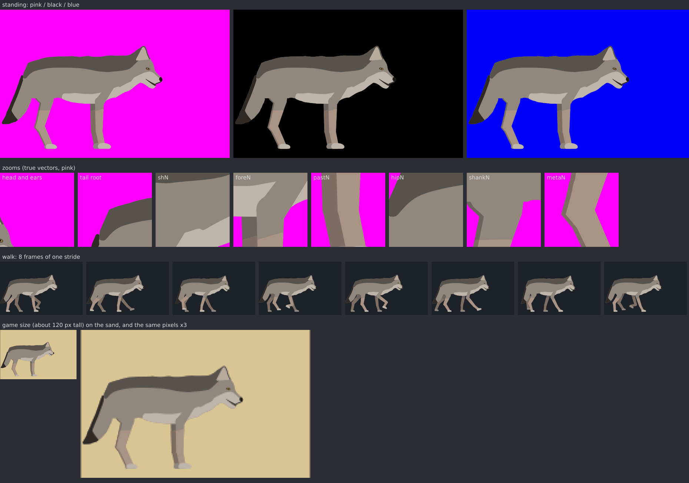
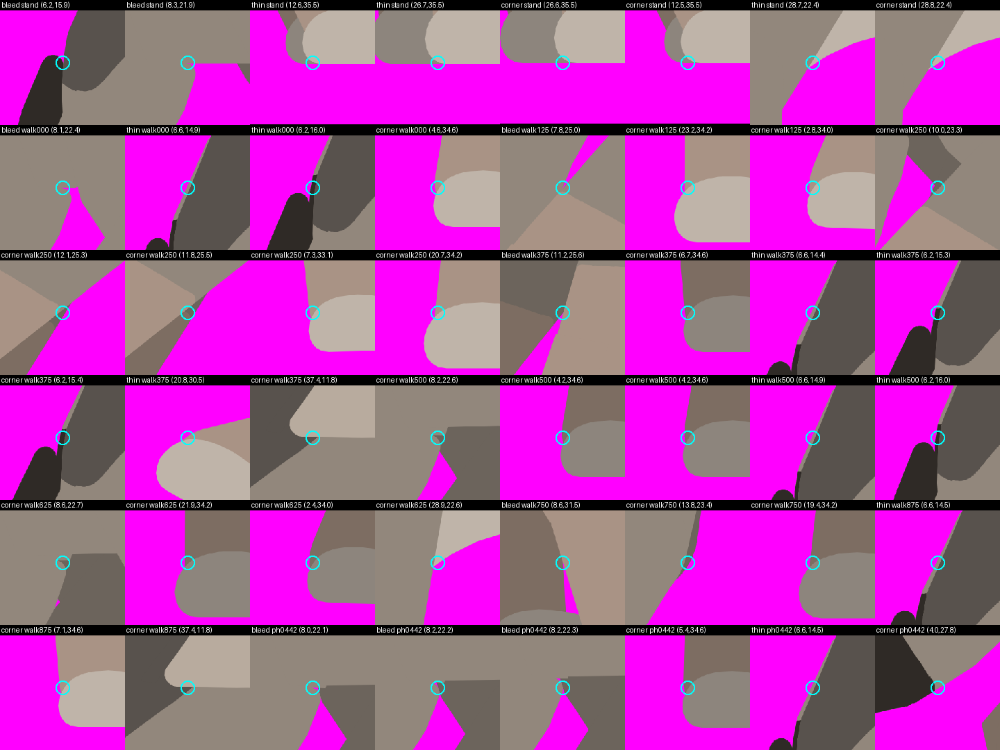
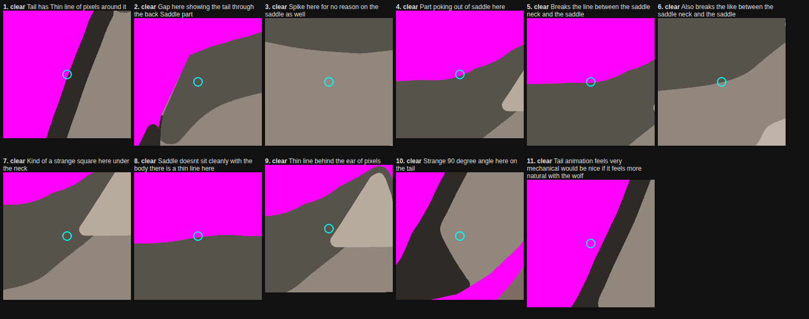
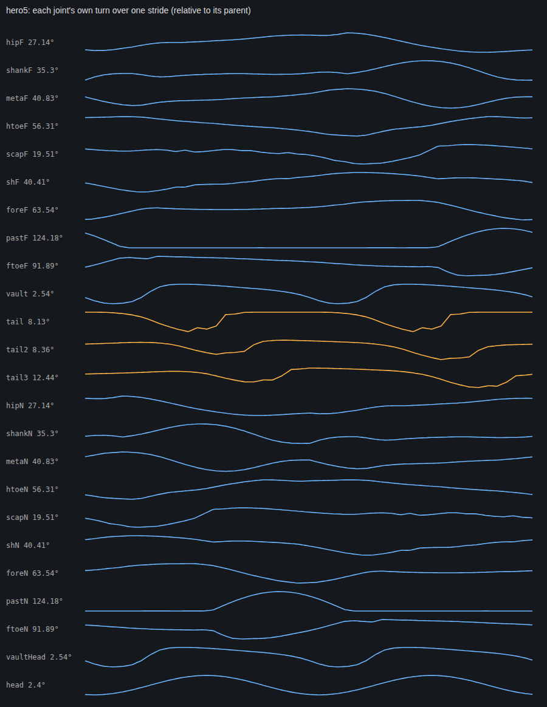
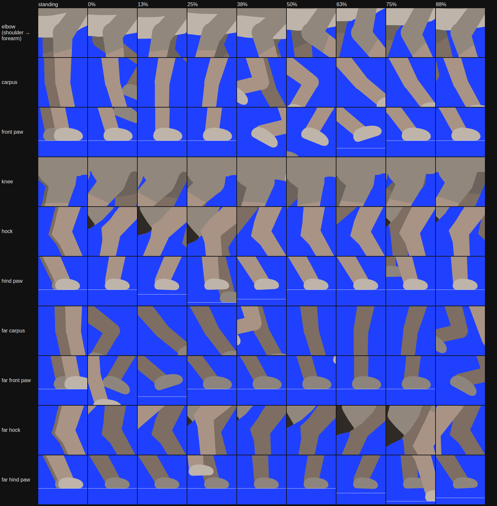
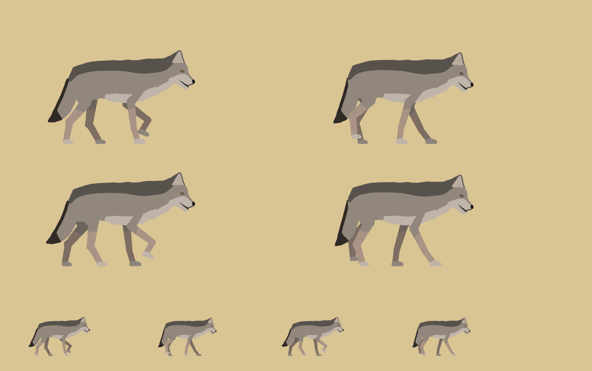
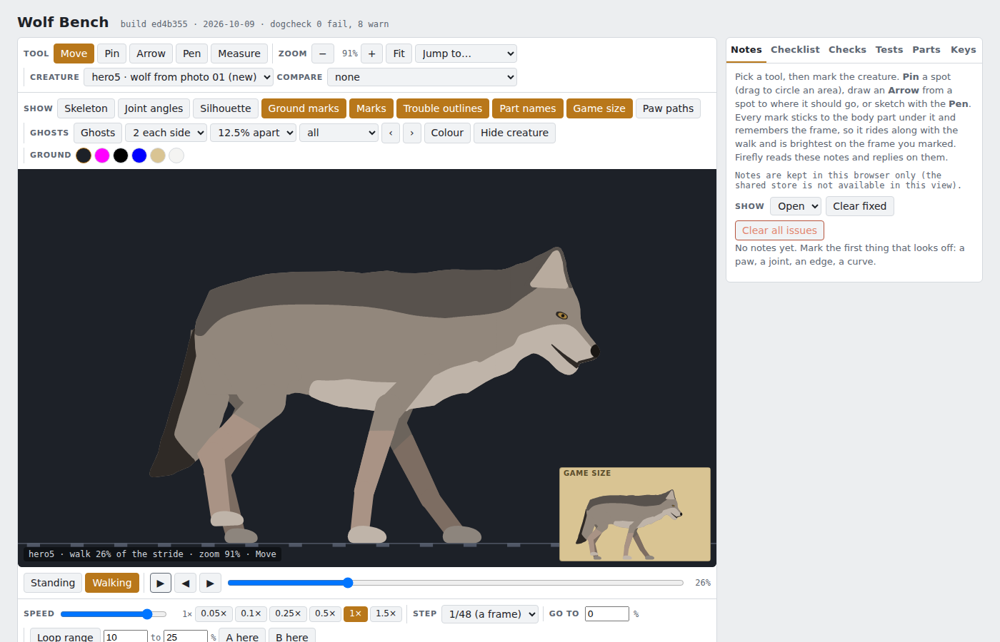

# QA hero5 · build ed4b355 · 2026-10-09 22:46 · 143 s

The standard art test (docs/claude/DEN-ART-QA.md). Run: `./den qa hero5 --notes=<dir>`.

## PASS · dogcheck

- 0 fail, 8 warn

## FAIL · edges

- 57 findings (10 bleed, 18 thin, 29 corner)
- bleed stand (6.22, 15.88): background shows through a seam, 0.03 units long
- bleed stand (8.34, 21.91): background shows through a seam, 0.05 units long
- thin stand (12.59, 35.52): a band of far pale under 0.12 units wide
- thin stand (26.72, 35.52): a band of far pale under 0.12 units wide
- corner stand (26.62, 35.54): a 70 degree point on the far pale edge
- corner stand (12.5, 35.54): a 64 degree point on the far pale edge
- thin stand (28.73, 22.44): a band of pale under 0.12 units wide
- corner stand (28.84, 22.41): a 94 degree point on the pale edge
- bleed walk000 (8.1, 22.38): background shows through a seam, 0.06 units long
- thin walk000 (6.56, 14.89): a band of fur under 0.12 units wide
- thin walk000 (6.19, 15.98): a band of furDark under 0.12 units wide
- corner walk000 (4.61, 34.61): a 79 degree point on the leg edge
- bleed walk125 (7.78, 24.98): background shows through a seam, 0.04 units long
- corner walk125 (23.22, 34.24): a 95 degree point on the leg edge
- corner walk125 (2.83, 34): a 82 degree point on the leg edge
- corner walk250 (10.01, 23.27): a 90 degree point on the far fur edge
- corner walk250 (12.11, 25.27): a 53 degree point on the far fur edge
- corner walk250 (11.84, 25.51): a 99 degree point on the far leg edge
- corner walk250 (7.31, 33.06): a 82 degree point on the leg edge
- corner walk250 (20.73, 34.22): a 91 degree point on the leg edge
- bleed walk375 (11.18, 25.59): background shows through a seam, 0.03 units long
- corner walk375 (6.71, 34.61): a 84 degree point on the far leg edge
- thin walk375 (6.6, 14.44): a band of fur under 0.12 units wide
- thin walk375 (6.25, 15.31): a band of furDark under 0.12 units wide
- corner walk375 (6.24, 15.41): a 44 degree point on the furDark edge
- thin walk375 (20.84, 30.49): a band of leg under 0.12 units wide
- corner walk375 (37.42, 11.85): a 60 degree point on the saddle edge
- corner walk500 (8.25, 22.6): a 81 degree point on the far fur edge
- corner walk500 (4.15, 34.61): a 60 degree point on the far leg edge
- corner walk500 (4.22, 34.61): a 80 degree point on the far leg edge
- thin walk500 (6.57, 14.87): a band of fur under 0.12 units wide
- thin walk500 (6.2, 16.01): a band of furDark under 0.12 units wide
- corner walk625 (8.59, 22.73): a 87 degree point on the far fur edge
- corner walk625 (21.9, 34.24): a 89 degree point on the far leg edge
- corner walk625 (2.43, 34): a 80 degree point on the far leg edge
- corner walk625 (28.91, 22.56): a 94 degree point on the pale edge
- bleed walk750 (8.55, 31.49): background shows through a seam, 0.05 units long
- corner walk750 (13.79, 23.38): a 58 degree point on the far fur edge
- corner walk750 (19.43, 34.22): a 91 degree point on the far leg edge
- thin walk875 (6.59, 14.46): a band of fur under 0.12 units wide

## PASS · notes

- 0 of 11 notes still show a finding at their spot (0 = all fixed by what the detector can see)
- 1  NOT caught  Tail has Thin line of pixels around it  @ (4.0, 19.5) ph0835
-  2  NOT caught  Gap here showing the tail through the back Saddle part  @ (8.0, 13.6) ph0835
-  3  NOT caught  Spike here for no reason on the saddle as well  @ (27.7, 16.1) ph0835
-  4  NOT caught  Part poking out of saddle here  @ (34.8, 9.9) ph0442
-  5  NOT caught  Breaks the line between the saddle neck and the saddle  @ (33.9, 10.2) ph0442
-  6  NOT caught  Also breaks the like between the saddle neck and the saddle  @ (33.8, 14.1) ph0442
-  7  NOT caught  Kind of a strange square here under the neck  @ (36.2, 11.7) ph0442
-  8  NOT caught  Saddle doesnt sit cleanly with the body there is a thin line here  @ (28.7, 10.3) ph0442
-  9  NOT caught  Thin line behind the ear of pixels  @ (36.7, 10.8) ph0442
- 10  NOT caught  Strange 90 degree angle here on the tail  @ (3.5, 25.5) ph0442
- 11  NOT caught  Tail animation feels very mechanical would be nice if it feels more natural with the wolf  @ (2.5, 22.7) ph0000

## PASS · motion

- 0 warnings
- PASS tail bend  the tail bends along its length (3 joints, skinned)
- PASS tail wave  each segment trails the one before by 0.068, 0.073 of a stride, swings 8.13 → 8.36 → 12.44 deg (a wave runs down it: wider toward the tip)
- PASS tail lag   the tail root trails the body by 0.172 of a stride (follow-through; 0 = locked to the body)
- PASS tail life  root swing 8.13 deg over a stride (under 3 reads stiff)
- PASS smooth     largest jerk 25.42 (pastF): no snaps

## PASS · joints

- every joint through the stride, for the eye

## PASS · pixi

- err none · errors none → /home/user/Dog/art/hero5/qa/pixi.png

## PASS · bench

- 4 pass, 0 fail (the sandbox's blocked web font is ignored)
- PASS hero5 in the creature menu: hero3|hero3 · wolf, hero5|hero5 · wolf from photo 01 (new), hero2|hero2 · the old dog
- PASS hero5 loaded
- PASS hero5 drawn on the stage: 37 shapes
- PASS back to hero3

